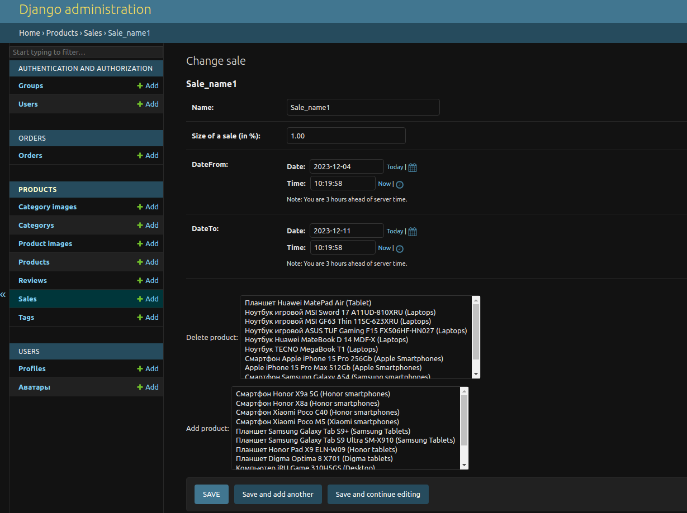
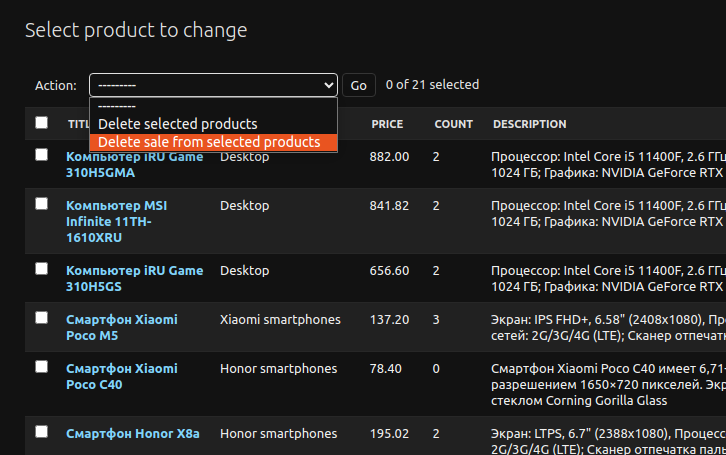

# Megano
### Данный проект представляет собой django-приложение интернет магазина Megano.
### Структура проекта.
Приложение frontend представляет собой подключаемое django-приложение, которое берет на себя все что связано с отображением страниц, а обращение
за данными происходит по API.
#### Структура API
1. orders - отвечает за запросы связанные обработкой заказов (список заказов пользователя, детальная информации о заказе, корзине, оплата)  
2. products - обрабатывает запросы связанные с каталогом товаров (список всех продуктов по категориям, акциям, детальная информация о продукте,
отзывы, а так же фильтрация по каталогу)
3. users - отвечает за обработку запросов связанных со входом/выходом пользователей, регистрацией, а так же за работу с профилем.

####  [Контракт API](swagger/swagger.yaml)

### Установка
    pip install requirements.txt
Установить пакет из директории dist: 

    pip install diploma-frontend-X.Y.tar.gz
X и Y - числа, они могут изменяться в зависимости от текущей версии пакета.

### Запуск
1.Запустить приложение:

    python manage.py runserver
2.Создать учетную запись администратора:

    python manage.py createsuperuser

3.Загрузить фикстуры:

    python manage.py loaddata fixtures.json

## Особенности работы с админкой
При работе со скидками реализована возможность добавлять и удалять сразу несколько продуктов:

При работе с продуктами реализовано действие с помощью которого можно удалить скидку сразу у нескольких продуктов:

